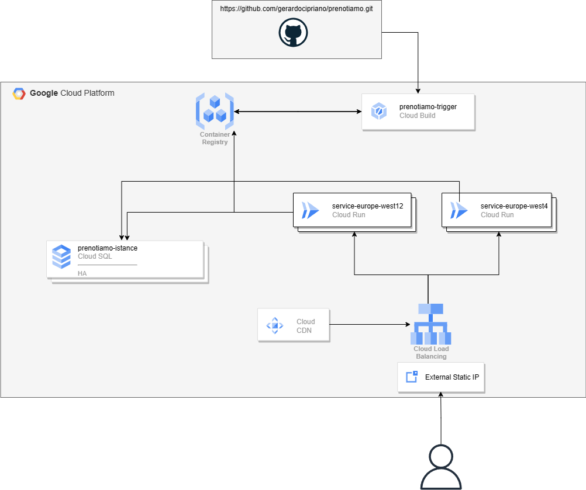
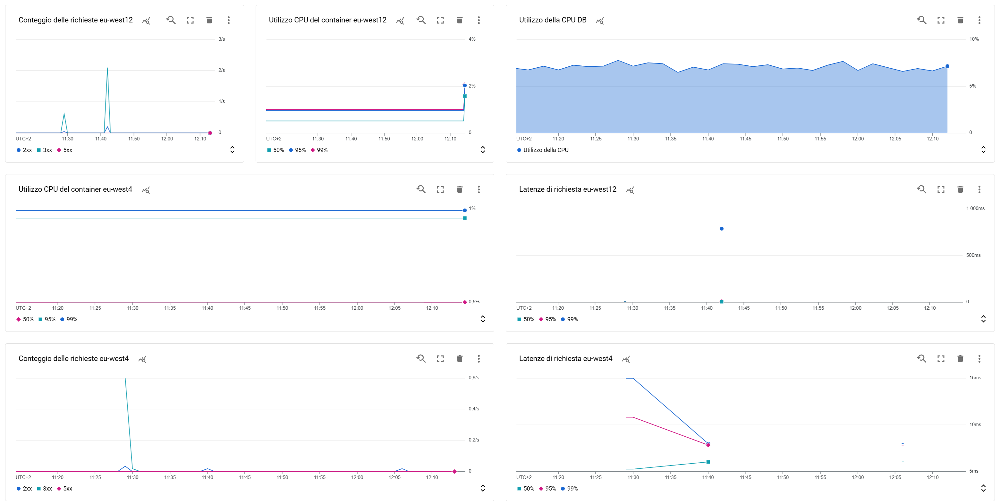

# Laboratorio di piattaforme e metodologie di sviluppo cloud

# Analisi

<a href="https://github.com/gerardocipriano/prenotiamo">Prenotiamo</a> è un App web sviluppata in Nuxt3 che consente ai dipendenti la prenotazione del pranzo.
By design, le applicazioni nuxt3 integrano in un unico progetto sia Frontend che Backend.
Il Backend fa riferimento ad un database mysql per la raccolta delle info (menu, ordini, aziende, etc).

# Design

Ho realizzato il deploy di questa applicazione su Google Cloud Provider. Lo schema dell'architettura che ho realizzato è il seguente:

<div align="center">
  <a href="https://github.com/gerardocipriano/prenotiamo">
    
  </a>
</div>

# Design dettagliato

Questa sezione elenca ciascun componente necessario al deploy in cloud dell'applicazione.

  <summary>Table of Contents</summary>
  <ol>
    <li><a href="#Container">Container</a></li>
    <li><a href="#Database">Database</a></li>
    <li><a href="#Run">Google Cloud Run</a></li>
    <li><a href="#Build">Google Cloud Build</a></li>
    <li><a href="#Alerts">Google Alerts</a></li>
  </ol>

## Container

Il primo step è stato quello di creare un Dockerfile che mi consentisse di traddure in un container il codice della mia applicazione scritta in nuxt.
Ho creato un branch <i>docker</i> all'interno del quale ho rimosso i file non necessari e poi ho creato il Dockerfile e il .dockerignore per ignorare altri file non necessari alla compilazione del progetto:

```yml
# Utilizzare un'immagine slim di Node.js come base
FROM node:lts-slim

# Impostare la directory di lavoro
WORKDIR /app

# Copiare i file package.json e package-lock.json
COPY package*.json ./

# Installare le dipendenze
RUN npm install

# Copiare il resto dei file dell'applicazione
COPY . .

# Esporre la porta 3000
EXPOSE 3000

# Avviare l'applicazione
CMD [ "npm", "run", "dev" ]
```

Ho creato un istanza del Container Registry su GCP.
Ho eseguito il build dell'immagine con il comando <i>docker build -t gcr.io/prenotiamo/prenotiamo-image . </i>
Dopo aver correttamente verificato il funzionamento del nuovo container, tramite la CLI gcloud ho eseguito il push dell'immagine sul container registry.

## Database

Tutti gli aspetti di creazione, gestione e distruzione del Database sono stati completamente automatizzati utilizzando Terraform. È stata creata una risorsa google_sql_database_instance chiamata prenotiamo_instance in una determinata location. Questa risorsa rappresenta un'istanza di database Cloud SQL per MySQL.

La versione del database è stata impostata a MYSQL_5_7. Sono state configurate anche le impostazioni del database, come il livello di servizio db-f1-micro (condiviso, il più economico) e il tipo di disponibilità REGIONAL **per garantire l'HA dell'istanza e la configurazione del backup**.

Sono state impostate alcune flag del database, come il timeout di attesa e il numero massimo di connessioni.

Sono state create due risorse google_sql_user per creare gli utenti del servizio che verranno utilizzati dalla WebApp per accedere al database. Sono stati specificati i nomi utente, le password e l'host per entrambi gli utenti.

Infine, è stata creata una risorsa null_resource per inizializzare il database. È stato utilizzato un provisioner local-exec per eseguire un comando mysql che popola il database con i dati dal file script.sql. Questa istruzione può essere lanciata solo da un client sul quale sia installato mysql.

In future versioni del progetto, si vorrebbe rimuovere l'accesso pubblico al database e sfruttare unicamente l'indirizzamento privato interno per far dialogare WebApp e DB.

Ho scelto un'istanza gestita di Cloud SQL invece di creare una propria istanza di database perché è più facile da configurare e gestire. Cloud SQL gestisce automaticamente le attività di manutenzione, come i backup e gli aggiornamenti, in modo da non dover gestirle manualmente.

Per maggiori dettagli sul codice, fare riferimento a https://github.com/gerardocipriano/deploy-terraform-gcp-prenotiamo/blob/7ab26a248b31017103d89cc07800ed77771a7af3/google_sql.tf

## Run

Tutti gli aspetti di creazione, gestione e distruzione di Google Cloud Run sono stati completamente automatizzati tramite l'utilizzo di Terraform.

Ci sono diversi motivi per cui ho scelto di utilizzare Cloud Run invece di GKE. Innanzitutto, Cloud Run è più economico poiché si paga solo per il tempo di elaborazione effettivamente utilizzato e non richiede la gestione di un cluster Kubernetes. Inoltre, Cloud Run è più facile da configurare e gestire rispetto a GKE.

Cloud Run è anche ben integrato con il servizio Cloud Build per garantire una pipeline di CI/CD, ed è completamente gestito da GCP per l'HA, l'accesso e la disponibilità.

È stata creata una risorsa chiamata "prenotiamo" nella regione specificata. Questa risorsa rappresenta un servizio Cloud Run che eseguirà la nostra applicazione.

Ho anche configurato l'autoscaling, dove i criteri sono gestiti automaticamente da GCP, con un minimo di 1 istanza e un massimo di 5 istanze.

Nel blocco "containers", ho specificato l'immagine Docker da utilizzare per il nostro servizio e ho impostato diverse variabili d'ambiente per la configurazione dell'applicazione. Dopo diversi test, ho impostato i limiti di risorse per la CPU e la memoria a 2 e 2 GB, rispettivamente.
Inoltre, ho configurato una sonda per monitorare il servizio nel container; se dovesse bloccarsi, la sonda lo rileverebbe  e creerebbe subito una nuova istanza funzionante.

Infine, è stata creata una risorsa per concedere l'accesso pubblico al nostro servizio Cloud Run. L'accesso al servizio, come detto in precedenza, è completamente gestito dal provider tramite un suo load balancer.

Per maggiori dettagli sul codice, fare riferimento a https://github.com/gerardocipriano/deploy-terraform-gcp-prenotiamo/blob/8d008d3ace546964e504e5abe00e4ece4408e0f2/google_run.tf

## Google Cloud Build

Google Cloud Build gestisce la parte di CI/CD, consentendo l'aggiornamento e il deployment automatico dell'immagine del container.

È stata creata una risorsa chiamata "prenotiamo_trigger"; questa risorsa è un trigger di Cloud Build che si attiva in seguito all'esecuzione di un push sul branch specificato del repository GitHub. Nel blocco "github" sono stati specificati il proprietario e il nome del repository GitHub da collegare a Cloud Build, nonché il branch da monitorare per i push. Questi valori sono stati impostati utilizzando le variabili "github_owner", "github_repo_name" e "github_branch".

È stato inoltre specificato il nome del file di configurazione di Cloud Build da utilizzare per il trigger, che in questo caso è "cloudbuild.yaml". Ciò significa che Cloud Build utilizzerà il file "cloudbuild.yaml" nella radice del repository GitHub per definire i passaggi di compilazione.

```yml
steps:
  - name: "gcr.io/cloud-builders/gcloud"
    args: ["builds", "submit", "--tag", "gcr.io/$PROJECT_ID/prenotiamo-image"]
  - name: "gcr.io/cloud-builders/gcloud"
    args:
      [
        "run",
        "deploy",
        "prenotiamo",
        "--image",
        "gcr.io/$PROJECT_ID/prenotiamo-image",
        "--region",
        var.location,
      ]
```

Per maggiori dettagli sul codice, fare riferimento a https://github.com/gerardocipriano/deploy-terraform-gcp-prenotiamo/blob/8d008d3ace546964e504e5abe00e4ece4408e0f2/google_build_trigger.tf

## Alerts

Sono state create diverse risorse di google_monitoring_alert_policy per configurare gli avvisi di monitoraggio per il servizio Cloud Run e il database Cloud SQL. In particolare, è stata creata una risorsa google_monitoring_alert_policy chiamata cloud_run_errors per configurare l'avviso relativo al numero elevato di errori del server. Il filtro è stato impostato per contare solo le richieste con codici di risposta 5xx e la soglia a 10 richieste in un periodo di 300 secondi. È stato anche specificato un canale di notifica email per ricevere notifiche quando l'avviso viene attivato.

Inoltre, è stata creata una risorsa google_monitoring_alert_policy chiamata cloud_run_latency per configurare l'avviso per la latenza elevata del servizio Cloud Run. Il filtro è stato impostato per misurare la latenza delle richieste e la soglia a 300 ms in un periodo di 60 secondi. Anche in questo caso, è stato specificato un canale di notifica email per ricevere notifiche quando l'avviso viene attivato.

È stata anche creata una risorsa google_monitoring_alert_policy chiamata cloud_sql_cpu per configurare l'avviso per l'utilizzo elevato della CPU del database Cloud SQL. Il filtro è stato impostato per misurare l'utilizzo della CPU e la soglia al 90% in un periodo di 300 secondi. Anche in questo caso, è stato specificato un canale di notifica email per ricevere notifiche quando l'avviso viene attivato.

Infine, è stata creata una risorsa google_monitoring_notification_channel chiamata email per configurare un canale di notifica email. È stato specificato un indirizzo email, anche se sarebbe opportuno utilizzare una DL o una SharedMailbox.

Per rendere il monitoraggio più fruibile, ho concentrato diverse metriche all'interno di una Dashboard:



Per maggiori dettagli sul codice, fare riferimento a https://github.com/gerardocipriano/deploy-terraform-gcp-prenotiamo/blob/8d008d3ace546964e504e5abe00e4ece4408e0f2/alert.tf

# Conclusioni e Considerazioni

Studiare Terraform è stato veramente interessante per me. Sono rimasto impressionato dalla facilità con cui potevo distribuire e distruggere l’infrastruttura. Inoltre, avere tutte le versioni dell’infrastruttura a portata di mano è stata una grande comodità. Questo mi ha permesso di gestire l’infrastruttura in modo più efficiente e sicuro.

Sono soddisfatto del lavoro che sono riuscito a fare studiando a fondo la documentazione di Terraform e GCP. Ho imparato molto e ho acquisito competenze preziose. Tuttavia, ci sono alcune aree che vorrei migliorare in futuro. Ad esempio, mi sarebbe piaciuto gestire la rete privata del cloud in modo più sofisticato, caricando Cloud Run in una subnet e il database in un’altra subnet e facendoli comunicare privatamente. In questo modo avrei potuto proteggere meglio il mio database senza doverlo esporre pubblicamente.

Anche la popolazione del database avrei voluto farla in modo più intelligente. La soluzione che ho scelto era quella che si adattava meglio alle mie esigenze, ma so che ci sono modi migliori per farlo. Inoltre, durante lo sviluppo di Prenotiamo, non ho previsto dei log. Questo mi ha impedito di sfruttare gli alert basati sui log come visti a lezione.

Questo esame mi ha anche permesso di consolidare le mie competenze su Docker e Kubernetes. Li avevo già studiati in altri corsi, ma vederli applicati in modo così concreto mi ha permesso di imparare veramente molto. Nelle prime versioni del mio progetto usavo un cluster Kubernetes per distribuire il container. Tuttavia, il tempo di distribuzione era alto e il costo anche. Inoltre, ho riscontrato un bug documentato su GitHub che mi ha fatto decidere di optare per Cloud Run. Questa scelta si è rivelata vantaggiosa anche per molti altri motivi.

Infine, avrei voluto distribuire Cloud Run su diverse regioni. Tuttavia, ho avuto problemi nella configurazione del load balancer (probabilmente legati al redirect tra HTTP e HTTPS) che non sono riuscito a risolvere. Per questo motivo ho deciso di mantenere la distribuzione semplicemente su una sola regione.

In generale, sono molto soddisfatto del lavoro che ho fatto e delle competenze che ho acquisito. So che ci sono ancora molte cose da imparare e migliorare, ma questo progetto mi ha dato una solida base su cui costruire il mio futuro professionale.


